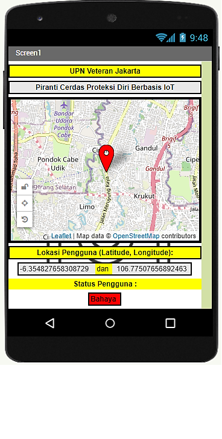
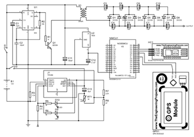

# GPS-Tracker-StunGun-App-firebase
Protection device using microcontroler ESP8266 WiFi Module and GPS GY-NEO6MV2 module using firebase database integrated with app

with the schematic like this
* using gps tracker to get coordinate longitude and latitude of the user position
* eps8266 is for sending to firebase database
* stun gun is using

